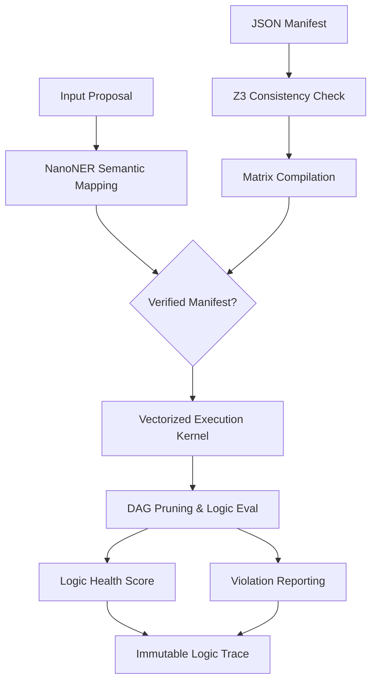

# System Architecture

LNT is a production-grade framework for enforcing deterministic logical constraints on probabilistic data flows. This document details the high-performance architecture powering the validation engine.

## Layered Architecture

The system is organized into strictly defined layers to separate semantic mapping from low-level logical execution, ensuring modularity and auditability.

### 1. Semantic Mapping Layer (`NanoNER`)
This layer bridges the gap between unstructured text and structured logic entities.
- **Approach**: Uses a deterministic fuzzy semantic extraction algorithm (`rapidfuzz`) to map linguistic variations to manifest-defined keys with zero-latency overhead.
- **Privacy**: Fully local execution ensures no PII leaves the privacy boundary during extraction.

### 2. Logic Verification Layer (Z3 SMT)
Before any manifest is active, it undergoes a rigorous formal verification step.
- **Goal**: Uses the Z3 SMT solver to mathematically prove that the declarative set of rules is consistent (non-contradictory) and satisfiable.
- **Mechanism**: Translates JSON constraints into Z3-compatible symbolic expressions, identifying logical paradoxes before deployment.

### 3. Compilation Layer (`LNTCompiler`)
LNT compiles declarative rules into highly optimized, immutable data structures.
- **Logic**: Transforms high-level JSON constraints into binary boundary matrices and dependency maps.
- **Implementation**: Uses NumPy arrays to enable SIMD-optimized vectorized operations for maximum throughput.

### 4. Vectorized Execution Kernel (`OptimizedKernel`)
The core execution engine.
- **Method**: Evaluates hundreds of constraints in parallel by comparing state vectors against boundary matrices using vectorized CPU instructions.
- **Status**: Production-verified. Delivers sub-millisecond latency (typically <0.1ms per transaction) on standard commodity hardware.

## Technical Workflow

## Data Governance Components
The architecture includes robust modules for compliance auditability:
- **Fairness Engine**: Automated, realtime calculation of disparate impact ratios across protected demographic traits (AIDA/EU-AI Act compliance).
- **Sovereign Telemetry**: Strict opt-in telemetry for quality improvement, with zero-leakage default settings.
- **Immutable Traces**: Cryptographically verifiable logs of every decision for post-hoc regulatory auditing.
