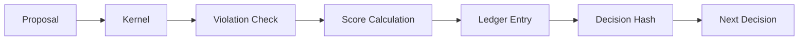

# Sovereign Architecture

LNT operates as a **Symbolic Gatekeeper** sitting between neural proposals and deterministic execution.

## 🌉 The Neuro-Symbolic Bridge

The architecture consists of three primary layers:

1.  **Perception Layer (NeuralParser)**: Transcribes unstructured text into structured entity proposals.
2.  **Logic Layer (KernelEngine)**: Manages the **Directed Acyclic Graph (DAG)** of constraints, weights, and temporal state.
3.  **Acceleration Layer (BELM)**: A JIT-compiled matrix kernel that executes logic at SIMD speeds.

## 🔒 Signature-Chained Ledger

Every decision generated by the Manifold is hashed and chained to the previous decision, creating a cryptographically secure audit trail.

