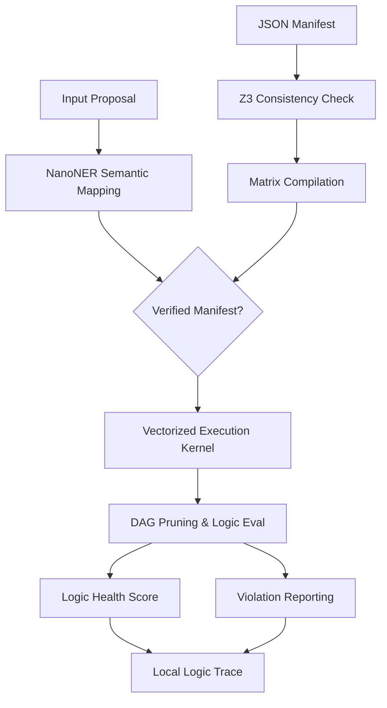

# Proposed System Architecture

LNT is a technical framework for evaluating deterministic logical constraints on unstructured data. This document details the current experimental architecture.

## Layered Architecture (Prototype)

The prototype is organized into layers to separate semantic mapping from logical execution.

### 1. Semantic Mapping Layer (`NanoNER`)
This layer provides a bridge between unstructured text and structured logic entities.
- **Approach**: Uses a fuzzy semantic extraction algorithm (`rapidfuzz`) to map linguistic variations to manifest-defined keys.
- **Privacy**: Local-only execution is a design goal to minimize data handling.

### 2. Logic Verification Layer (Z3 SMT)
Before a manifest is ingested, LNT provides an experimental verification step.
- **Goal**: Uses the Z3 SMT solver to check if the declarative set of rules is consistent (non-contradictory) and satisfiable.
- **Mechanism**: Translates JSON constraints into Z3-compatible symbolic expressions.

### 3. Compilation Layer (`LNTCompiler`)
To explore performance, LNT compiles declarative rules into structured data.
- **Logic**: Transforms JSON constraints into boundary matrices and dependency maps.
- **Implementation**: Uses NumPy arrays to enable vectorized operations.

### 4. Vectorized Execution Kernel (`OptimizedKernel`)
The core execution logic.
- **Method**: Evaluates constraints by comparing a state vector against boundary matrices using vectorized operations.
- **Status**: Preliminary testing shows this approach can offer low latency, though it has not been benchmarked in diverse production environments.

## Technical Workflow (Exploratory)

## Data Governance Research
The prototype includes experimental modules for:
- **Disparate Impact Logic**: Automated calculation of outcome ratios across demographic traits (80% rule research).
- **Local Logic Traces**: Recording evaluation results for auditing purposes.
