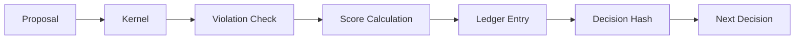

# System Architecture

LNT operates as a **Deterministic Validation Layer** sitting between neural proposals and downstream execution systems.

## 🌉 The Neuro-Symbolic Bridge

The architecture consists of three primary layers:

1.  **Orchestration Layer (LNTClient)**: Manages the lifecycle of validation requests and manifest loading.
2.  **Logic Engine (SynthesisManifold)**: Evaluates the **Directed Acyclic Graph (DAG)** of constraints, weights, and temporal state.
3.  **Optimization Kernel (BELM)**: A JIT-compiled matrix kernel that executes rule logic using vectorized SIMD operations.

## 🔒 Audit Integrity

Every decision generated by the Manifold is hashed and chained to the previous decision, creating a cryptographically secure audit trail.

