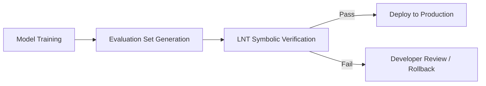

# MLOps Integration Guide: LNT Sovereign as a Logic Gate

LNT Sovereign provides a deterministic verification layer for AI behavioral logic. This guide explains how to integrate it into your MLOps pipeline for automated safety and governance.

## 1. The LNT Workflow in CI/CD

LNT evaluates model outputs against symbolic constraints to ensure behavioral integrity.



## 2. Integration Modes

### Advisory Mode (Soft Governance)
Use this during initial model development to observe logic drift without blocking the pipeline.

```bash
lnt check --manifest security_policy.json --input model_eval.json --advisory
```

### Enforcement Mode (Mandatory Safety)
Use this for mission-critical deployments where violating a rule (like a regulatory constraint) is unacceptable.

```bash
# Fails the build if a 'TOXIC' rule is hit or score < 95
lnt check --manifest compliance.json --input audit_data.json --fail-on-toxic --fail-under 95
```

## 3. GitHub Actions Integration

For a complete, copy-pasteable template, see [lnt-sovereign.yml](file:///c:/Users/DELL/Desktop/ccfraude/examples/mlops/lnt-sovereign.yml). 

You can also add LNT directly to your `.github/workflows/mlops.yml`:

```yaml
jobs:
  governance:
    runs-on: ubuntu-latest
    steps:
      - uses: actions/checkout@v4
      - name: Install LNT
        run: pip install lnt-sovereign
      - name: Run Behavioral Audit
        run: |
          lnt check --manifest manifests/production_policy.json \
                    --input data/latest_eval.json \
                    --fail-on-toxic \
                    --json-report artifacts/audit_report.json
      - name: Archive Audit Trail
        uses: actions/upload-artifact@v4
        with:
          name: sovereign-audit-trail
          path: artifacts/audit_report.json
```

## 4. Why Use LNT in MLOps?

- **Audit Integrity**: Every deployment generates a SHA-256 signature-chained decision ledger.
- **Model Verification**: Catch when a model starts producing outputs that violate established deterministic bounds.
- **Regulatory Compliance**: Provide clear evidence that AI systems operate within defined safety manifolds.
