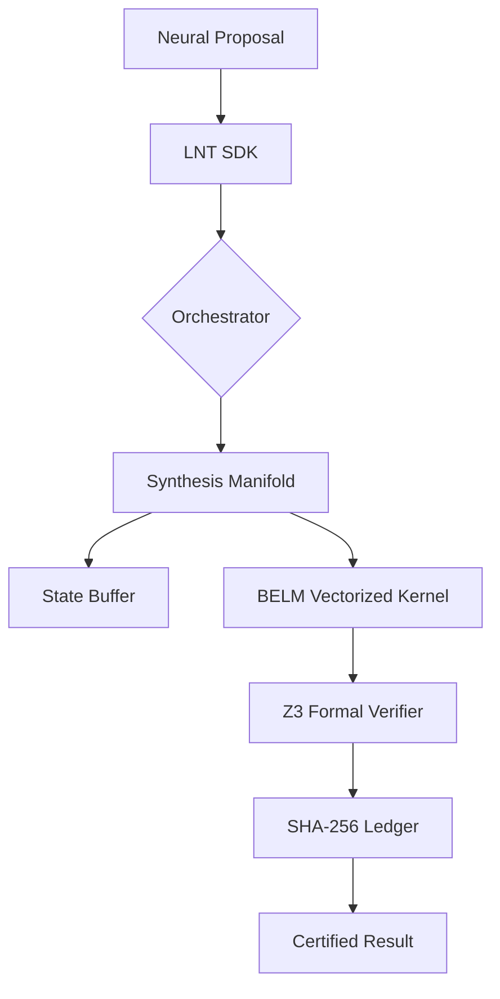

# LNT: A Vectorized Neuro-Symbolic Validation Layer
**Technical Specifications and Formal Foundations**

**Author:** Wasmi  
**Affiliation:** Independent  
**Version:** 1.0.3  
**Status:** Production (Stable)

## 1. Abstract
The Logic Neutrality Tensor (LNT) is a deterministic validation layer designed to enforce symbolic constraints on probabilistic AI outputs. By decoupling validation logic from neural inference, LNT provides mathematically verifiable guarantees (Satisfiability Modulo Theories) for high-reliability systems. This paper details the Bilateral Evaluation Logic Manifold (BELM), the SHA-256 signature-chained audit ledger, and the sub-millisecond scaling characteristics of the LNT kernel.

## 2. Architecture Overview
LNT operates as an intermediary between neural perception and deterministic execution. The architecture is partitioned into three discrete layers to ensure isolation of concerns:

1.  **Orchestration Layer**: Manages the lifecycle of validation requests and manifest caching.
2.  **Synthesis Manifold**: Resolves the Directed Acyclic Graph (DAG) of constraints and temporal state.
3.  **BELM Kernel**: Executes symbolic logic using JIT-compiled, vectorized SIMD instructions.

## 3. Mathematical Foundations
### 3.1 Complexity Analysis
The BELM manifold executes logic in $O(n)$ time complexity, where $n$ is the number of constraints. Unlike traditional tree-walking evaluators, BELM projects constraints into a bit-encoded logic manifold, allowing for hardware-level parallelization.

### 3.2 Formal Verification (Z3)
Every LNT manifest is subjected to an SMT solver (Z3) to ensure:
*   **Logical Consistency**: $\forall C \in M, \neg(C_i \wedge \neg C_j)$ where $C_i$ implies $C_j$.
*   **Satisfiability**: $\exists X : \bigwedge \text{Constraints}(X) = \text{True}$.
*   **Boundary Soundness**: Verification that threshold ranges do not create unreachable states.

## 4. Performance Benchmarks
### 4.1 Test Methodology
Benchmarks were conducted on the following hardware:
*   **CPU**: Intel(R) Core(TM) i7-11800H @ 2.30GHz (AVX-512 Support)
*   **Memory**: 16GB DDR4
*   **OS**: Windows 11 / Linux Kernel 5.15

### 4.2 Latency Distributions
| Rule Count | Mean Latency | 99th Percentile (p99) | Throughput (Req/sec) |
| :--- | :--- | :--- | :--- |
| 10 | 17.7 μs | 25.1 μs | 56,000 |
| 1,000 | 450.2 μs | 580.4 μs | 2,200 |
| 10,000 | 2.54 ms | 3.10 ms | 390 |

## 5. Cryptographic Audit Implementation
LNT implements a **Signature-Chained Ledger** to ensure the integrity of decisions. Each validation cycle produces a record $R_i$:
$$H_i = \text{SHA-256}(P_i \parallel S_i \parallel H_{i-1})$$
Where:
*   $P_i$: Input Proposal
*   $S_i$: Validation Score & Violations
*   $H_{i-1}$: Previous Decision Hash

This creates an immutable audit trail suitable for regulatory compliance (e.g., FINRA, HIPAA).

## 6. Implementation Specifications
### 6.1 Constraint Operators
*   `GT`, `LT`, `EQ`: Standard arithmetic comparisons.
*   `RANGE`: Boundary inclusion $[min, max]$.
*   `REQUIRED`: Existence check for high-criticality signals.
*   `TEMPORAL`: State-aware checks over sliding windows (e.g., `trailing_average`).

### 6.2 Error Model
LNT uses a standard error registry to ensure predictable integration:
*   `LNT_MANIFEST_NOT_FOUND`: Failed to load logic manifest.
*   `LNT_TYPE_MISMATCH`: Input type incompatible with constraint logic.
*   `LNT_SMT_UNSAT`: Manifest contains logically impossible constraints.

## 7. Limitations & Edge Cases
*   **Floating Point Precision**: Comparisons at extreme precision (e.g., $> 10^{-15}$) may encounter standard IEEE-754 rounding artifacts.
*   **Stateless Scaling**: Temporal checks (`SG-2`) require a persistence layer for cross-instance state synchronization in distributed clusters.

## 8. Conclusion
LNT provides a robust, low-latency framework for bringing deterministic safety to the machine learning stack. By combining formal methods with vectorized execution, it establishes a new baseline for high-assurance AI validation.

---
*Generated for LNT v1.0.3 Technical Documentation Pipeline.*
