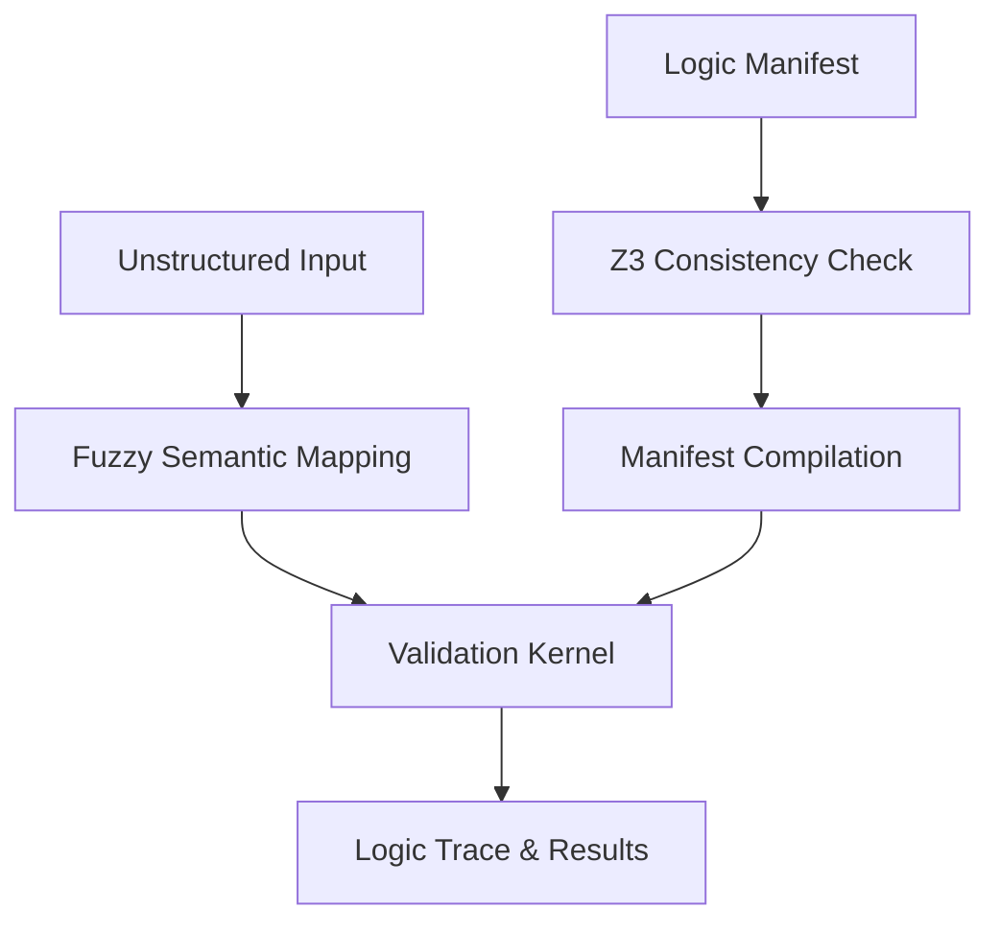

# Technical Proposal: Vectorized Neuro-Symbolic Validation
**Research Overview and Design Specifications**

**Version:** 0.1.0-alpha  
**Status:** Research Prototype

## 1. Abstract
This document outlines a proposed architecture for the Logic Neutrality Tool (LNT), a technical framework designed to investigate the enforcement of symbolic constraints on probabilistic model outputs. The proposal explores the decoupling of validation logic from primary inference to potentially provide verifiable guarantees (Satisfiability Modulo Theories) for industrial automation.

## 2. Conceptual Architecture
The proposed architecture is organized into three exploratory layers:

1.  **Semantic layer**: Investigates the use of fuzzy semantic matching to bridge natural language and structured logic.
2.  **Kernel Layer**: Explores high-throughput validation using vectorized matrix operations.
3.  **Formal layer**: Integrates SMT solvers (Z3) to test manifest consistency during pre-deployment.

## 3. Implementation Research
### 3.1 Vectorized Logic
LNT explores representing constraints as boundary matrices. By comparing state vectors against these matrices using libraries like NumPy, the project aims to minimize evaluation overhead. 

### 3.2 Formal Verification (Z3)
A core area of research is the translation of JSON constraints into SMT-LIB expressions. This allows developers to use the Z3 solver to find potential contradictions in their business logic before it is used.

## 4. Performance Goals
Preliminary testing of the vectorized kernel suggests that evaluation latency for simple rule sets (< 100 constraints) can be achieved in the microsecond range. However, comprehensive performance profiling across diverse hardware and high-concurrency environments remains a future work item.

## 5. Statistical Fairness Monitoring
The prototype implements outcome-based monitoring to detect disparate impact. The current implementation focuses on the 80% rule (four-fifths rule) as a starting point for fairness research in automated decision-making.

## 6. Conclusion and Future Work
LNT is a technical exploration into bringing greater determinism to AI-integrated systems. Future work includes expanding the supported logic operators, improving local extraction performance, and seeking third-party validation of the core formal methods implementation.

---
*LNT Research Documentation - v0.1.0-alpha*
